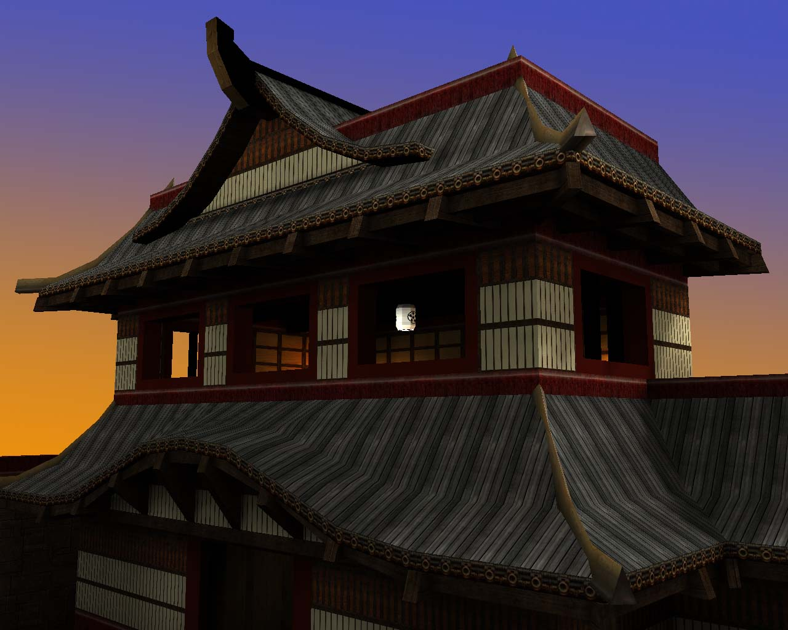
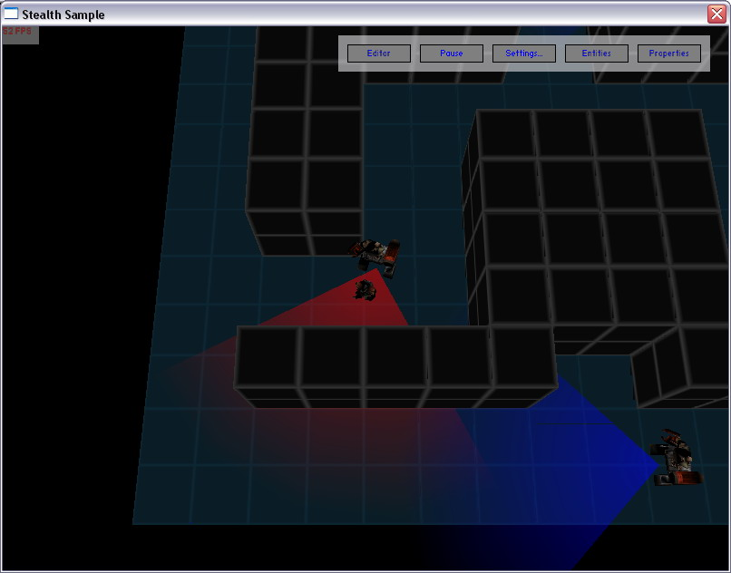
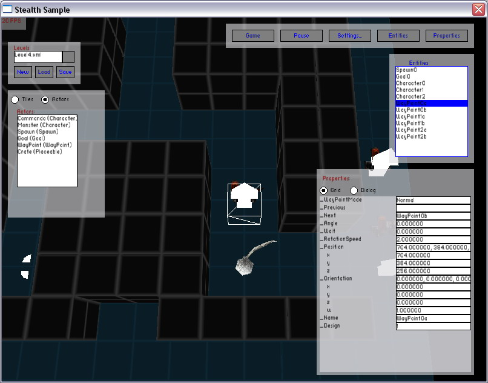
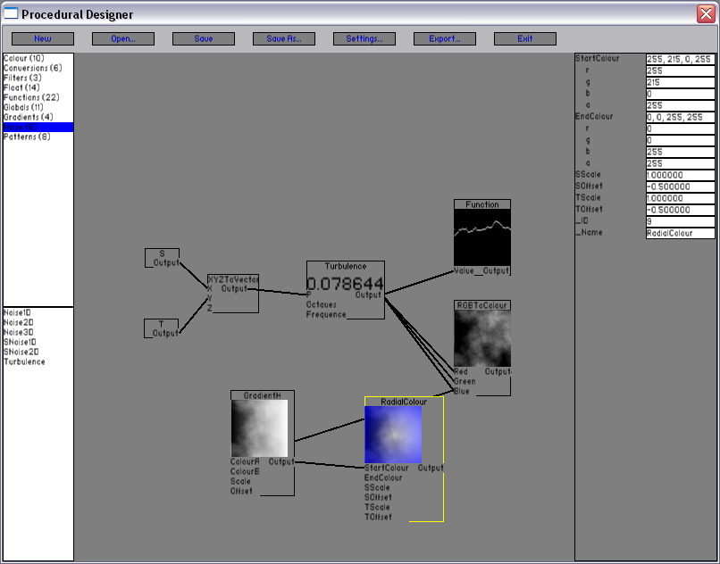
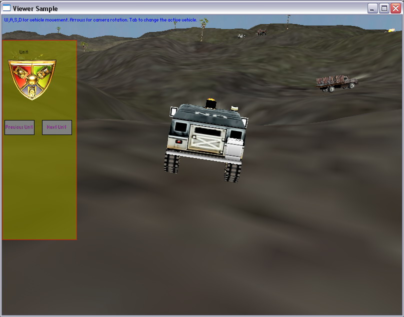
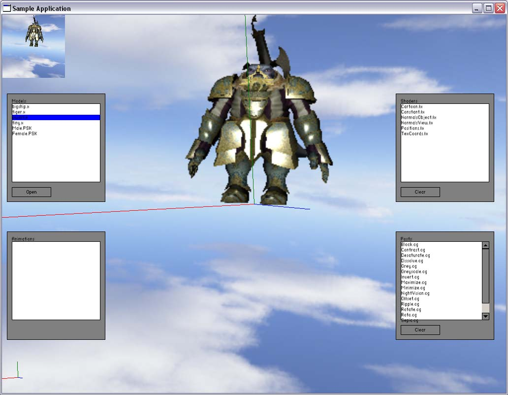
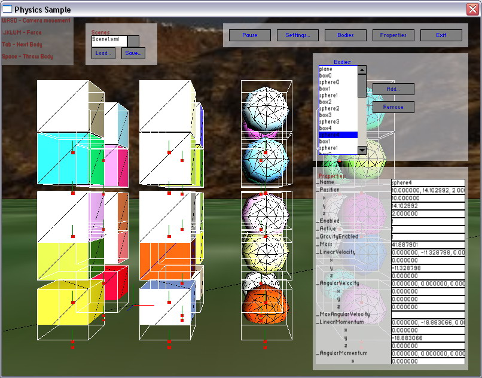
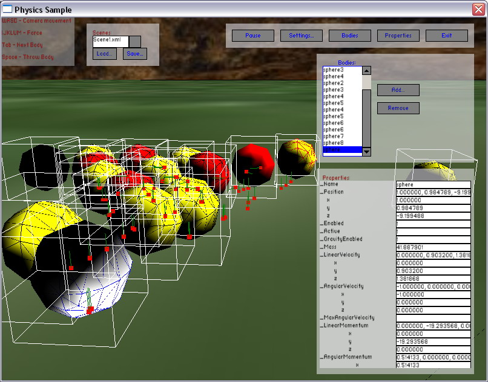
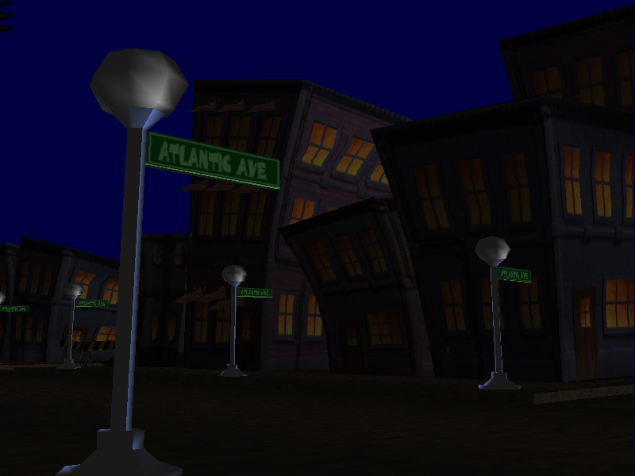

# Sonata Engine
Sonata Engine is a personal project that demonstrate how to write a Game Engine Runtime.

It includes fundamental features such as Reflection, Serialization, Forward Rendering, Phsycis and UI.

The Runtime is implementation on multiple APIs for different systems.

The Runtime provides a common set of features that are platform-independent.

Plugins provide platform-specific and third-party implementations (Direct3D, OpenGL, PhysX...).

# Platforms
* Windows
* SDL

# Features 
## Core
* Types
  * Flags
  * String
  * ID (128-bit)
  * Variant
  * Point / Size / Rectangle
  * Colors (integer 8-bit and floating point 32-bit)
* Containers
  * Array (vector)
  * List (linked list)
  * Hashtable (set)
  * Dictionary (map)
  * Stack / Queue
* C++
  * Reflection (macros)
  * Serialization
* IO
  * File Systems
    * Disk
    * Archive
  * Streams
    * Binary
    * Memory
    * Text
    * Console
* Mathematics
  * Vectors, Matrices, and Quaternion
  * Bounding Box (AABB, OBB) and Bounding Sphere
  * Shapes: Plane, Frustum, Capsule, Cylinder
  * Computations (Projections, Euler Angles)
  * Interpolations
  * Intersections (Box, Sphere, Ray, Line)
## Debug
* Log
  * Level
  * Filter
  * Formatter
  * Handlers
* Visualizers
  * Bounding Shapes
  * Normals
* Gizmos
  * Axis
  * Grid
  * Skeleton
## Input
* Keyboard
* Mouse
* Gamepad
## Graphics
* Scene Graph
  * Node Hierarchy
  * Transforms
* Geometry
  * Model / Mesh / Mesh Part
  * Skeleton and Bones
  * Socket support (attachments)
  * Procedural Geometry
    * Plane
    * Box
    * Sphere
* Shader System
  * Vertex and Pixel Shaders
  * Render States
  * Shader Uniforms
* Lighting
  * Forward Lighting with Point, Direction and Spot Lights
* Sky Box and Sky Dome
* Particles
  * Multiple Emitters
  * Multiple Sources (point, cube...)
* Terrain
  * Multiple Generators
* Font
  * Bitmap
  * TTF
* 2D
  * Sprites
* Sofware Rasterizer
* Sofware Raytracer
## Animation
* Transform Keyframes
* Morphing (CPU and GPU)
## UI
* Controls
  * Window
  * Panel / Scrollable Panel
  * Label
  * Text Box
  * Push Button
  * Checkbox Button
  * Radio Button
  * Progress Bar
  * List Box
  * Combo Box
  * Image (with support for render to texture)
* Theme support
* Modal dialogs
* Node Graph
## Audio
* Streaming
* Listener
* Audio Source
* Audio Channels
## Physics
* Rigid Body and Joints
* Physics Materials
* Collision (multiple shapes)
* Software Implementation
## AI
* State Machine (FSM)
* Pathfinding (A*)

# Third-Party
## Graphics
* Diect3D 8
* Diect3D 9
* OpenGL
* Cg
## Audio
* DirectSound 8
* OpenAL
## Input
* Windows
* DiectInput 8
* XInput
## Physics
* PhysX
* ODE

# Game Framework
* Entity
* Cameras
* Messaging and Events

# Formats
* .ZIP
* .DDS
* .BMP
* .TGA
* .DDS
* .3DS
* .OBJ
* .X
* .WAV
### Games
* Quake Models (.MDL, .MD2, .MD3) and Maps (.BSP)
* Unreal .PSK

# Samples
* Model Viewer
* Physics Sandbox
* AI (2D and 3D, Pathfinding)
* Scripting with LUA
* UI Gallery
* Procedural Texture Editor (node graph)
* Stealth Prototype (inspired by MGS)
* Terrain Prototype (vehicle driving)
* Sofware Rasterizer
* Sofware Raytracer

# Images

